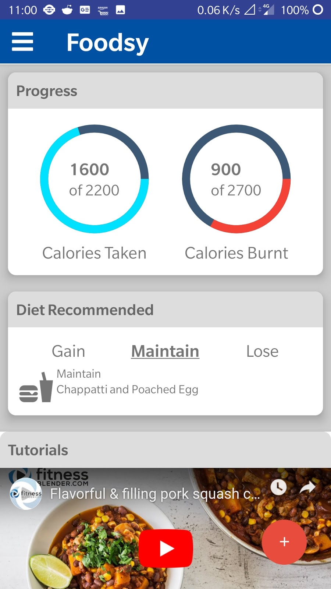
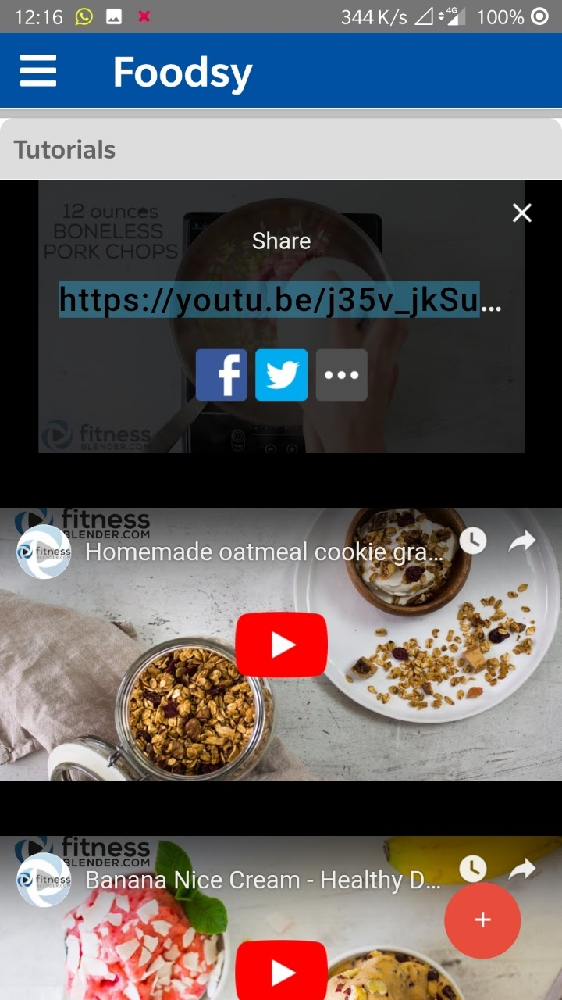

# Foodsy Mobile App

This mobile app was made for the Unskript 2019 hackathon, the goal was to make a food application for having and mantaining healthy habits.
The app has the following features:
- Identifies Most Cuisine Items using a classifier built in Pytorch and hosted on Render.com
- Animated Exercise Tutorial 
- Video Tutorial Links embedded fitness Youtube videos
- Interactive Chat Bot using Diagflow by Google, trained with fitness problems
- Uses Google Reverse Search for Items that the classifier is not trained for
## Exercise GIFs:  

## Screenshots
### Home Screen  
  
   
   
### Video Page  
  

